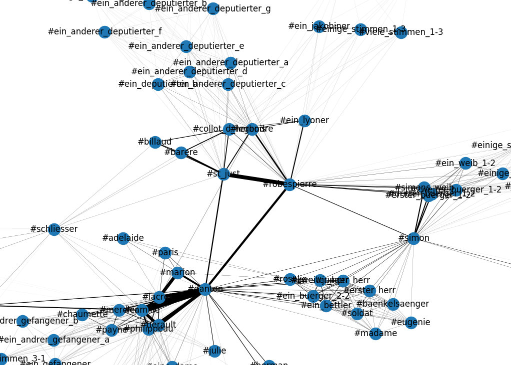

A Tool for Analyzing Dramatic Texts
===================================

`pygradrana` is a library and tool for analyzing dramatic texts. It is
written for the Digital Humanities community. It is has a parser for
TEI-encoded plays and offers functions for generating configuration
matrices of plays like described by Solomon Marcus[1], social network
graphs and some inspections useful for evaluating a play's text
encoding.

## Features

- parser for TEI-encoded plays
- generate configuration matrix, i.e. a table where the columns
  represent the scenes of a play and the rows represent the persons
  (figures). If a person is present on a scene, the table cell has a
  non-zero value.
- generate the social network graph's adjacency matrix
- values in these matrices can be calculated using several evaluation
  functions, e.g. a persons presence on the stage, the count of his
  contributions to the talk on the scene, the length of his utterances
  in words or characters (letters).
- several methods for calculating edge weights from the values in the
  configuration matrix
- calculate the degree of the social network graph's nodes
- calculate the nodes' average degree
- XHTML and LaTeX output of matrices
- visualization of social network graph

## Installation

Requirements:

- Python 3.x (tested on Python 3.5 on Debian stretch)
- networkx
- Matplotlib
- LaTeX (only if you want to create nice PDFs with matrices)

Clone this repository, `cd` into the base directory of the clone and
run

	pip3 install .

This will install `pygradrana` and the required python packages
`networkx` and `Matplotlib`.

## Usage

`pygradrana` comes with a command line program called
`gradrana`. This program has subcommands. To get help on the
subcommands run

	gradrana SUBCOMMAND -h

on the commandline. An alternative name of the program is
`dranalyze`. The subcommands are

**configuration**
: Generate a configuration matrix of the analyzed play.
**graph**
: Generate a social network graph of the analyzed play.
**structuring**
: Inspect the structuring (acts, scenes) of a dramatic text. This may
help to find annotation errors.

## History

`pygradrana` was written in 2019 for a digital humanities course at
[FernUniversität in Hagen](http://www.fernuni-hagen.de).

## Examples

Checkout the [configuration matrix](doc/dantons-tod_config.pdf) and
the
[social network graph's adjacency matrix](doc/dantons-tod_adjacency.pdf)
of Georg Büchners dramatic play *Dantons Tod*. The TEI-document came
from [gerdracor](https://github.com/dracor-org/gerdracor). `gradrana`
was called with the `--words` option, i.e. the words a dramatic person
contributed to each scene's talk was evaluated. Checkout the
visualization of the social network graph of that same play below.

## License

This project is licensed under the terms of the MIT license.

## Reference(s):

[1] Solomon Marcus: Mathematische Poetik, Bukarest/Frankfurt
a.M. 1973, 278-370
